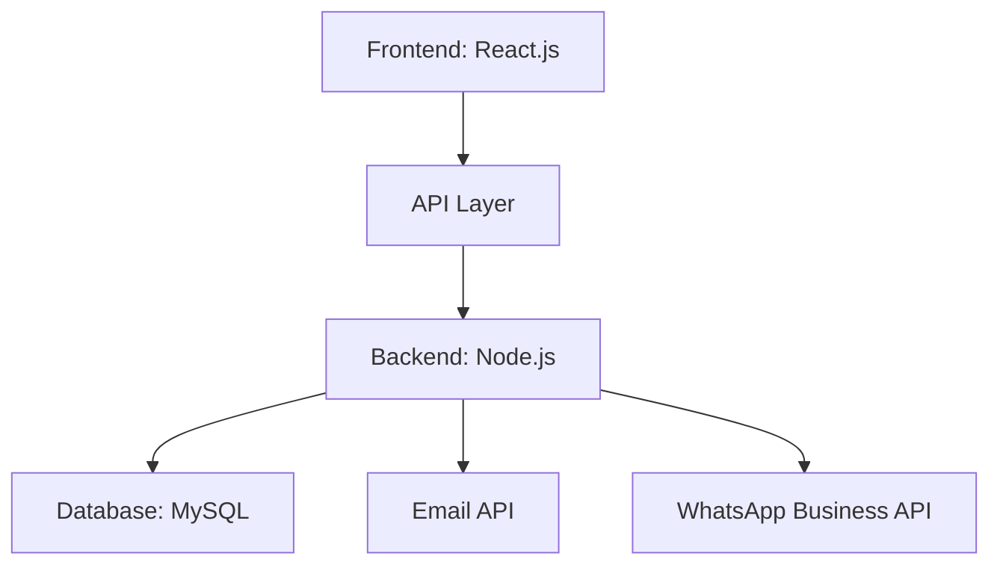

# 🎓 AutoShed: Smart Presentation Scheduling System


## 📋 Project Overview

**AutoShed** is a comprehensive smart presentation scheduling system designed specifically for higher educational institutions. The system revolutionizes traditional manual scheduling processes by introducing a logical, automated approach to coordinating academic presentations.

<details>
<summary><b>🔍 The Problem</b></summary>

Academic institutions frequently struggle with:
- Inefficient manual scheduling processes
- Communication gaps between stakeholders
- Underutilization of available resources
- Time-consuming administrative tasks
- Scheduling conflicts and overlaps
</details>

## ✨ Our Solution

AutoShed transforms presentation scheduling through intelligent automation and stakeholder coordination.

### 🛠️ Core Features

<details>
<summary><b>Role-Based Access Control</b></summary>

- **Administrators:** Manage system users and time slots
- **Lecturers:** Submit availability and manage assigned presentations
- **Examiners:** Submit availability and manage assigned presentations
- **LICs (Lecturers in Charge):** Schedule presentations and handle reschedule requests
</details>

<details>
<summary><b>Availability Matching Logic</b></summary>

- Automated matching of lecturer and examiner availability
- Conflict prevention through intelligent scheduling algorithms
- Optimal resource allocation
</details>

<details>
<summary><b>Multi-Channel Notifications</b></summary>

- Email notifications with calendar invites
- WhatsApp integration for immediate updates
- Real-time communication for schedule changes
</details>

## 🏗️ Technical Architecture



## 💻 Tech Stack

- **Frontend:** React.js with responsive UI design
- **Backend:** Node.js for robust server-side processing
- **Database:** MySQL for data persistence
- **Integrations:** Email API and WhatsApp Business API

## 📊 Project Impact

Implementation testing has demonstrated:
- Reduction in scheduling time from days to hours
- Elimination of double-bookings and conflicts
- Streamlined communication between all stakeholders
- Improved resource utilization
- Enhanced user satisfaction through automated notifications

## 🔄 Development Approach

The system is being built in an agile framework with two sprints:

<details>
<summary><b>Sprint 1 Focus</b></summary>

- User authentication and dashboard interfaces
- Core availability submission functionality
- Initial notification system setup
- Time slot management
</details>

<details>
<summary><b>Sprint 2 Focus</b></summary>

- Schedule confirmation workflows
- Advanced notification features
- Reporting and analytics
- Conflict resolution mechanisms
</details>

## 📱 Feature Screenshots

<table>
  <tr>
    <td></td>
    <td></td>
  </tr>
  <tr>
    <td></td>
    <td></td>
  </tr>
</table>

## 👥 Team Members and Contributions

<details>
<summary><b>IT22300164 - Ellepola E.W.P.W.M.R.S.K.</b></summary>

**Focus:** Lecturer functionalities and email notification features
- Lecturer authentication and dashboard UI
- View scheduled presentations for lecturers
- Availability submission form for lecturers
- Update/delete availability functionality for lecturers
- Shared work on LIC dashboard and authentication
- Presentation scheduling interface
- WhatsApp and Email notification setup
- Schedule confirmation/reschedule request functionality for lecturers
- Automated emails and calendar invites
- Schedule report generation
</details>

<details>
<summary><b>IT22590930 - Bandaranayeke E.M.T.T.</b></summary>

**Focus:** Examiner functionalities and WhatsApp notification features
- Examiner authentication and dashboard UI
- View scheduled presentations for examiners
- Availability submission form for examiners
- Update/delete availability functionality for examiners
- LIC dashboard and authentication
- Presentation scheduling interface
- WhatsApp and Email notification setup
- Schedule confirmation/reschedule request functionality for examiners
- Automated WhatsApp messages with clickable links
- Examiner reschedule request handling for LICs
- Schedule report generation
</details>

<details>
<summary><b>IT22608536 - Aththanayake A.M.P.M.B</b></summary>

**Focus:** Administrative functionalities and reporting
- Admin authentication and dashboard UI
- Lecturer management (CRUD operations)
- LIC management (CRUD operations)
- Examiner management (CRUD operations)
- Time slot management interface
- User report generation
- Time slot report generation
- Chart implementation
</details>

## 🚀 Getting Started

### Prerequisites

```bash
# Install Node.js and npm
# Install MySQL
```

### Installation

```bash
# Clone the repository
git clone https://github.com/your-username/autoshed.git

# Navigate to project directory
cd autoshed

# Install dependencies
npm install

# Configure environment variables
cp .env.example .env
# Edit .env with your database and API credentials

# Run database migrations
npm run migrate

# Start the development server
npm run dev
```

## 📄 License

This project is licensed under the MIT License - see the [LICENSE](LICENSE) file for details.

## 🔮 Future Recommendations

While initial results are promising, comprehensive user acceptance testing with actual stakeholders is recommended before full deployment to ensure the system meets all user needs and expectations.

---

<p align="center">
  <b>Group Number:</b> 3Y2S_WE_IT_199 / 2025 • 
  <b>Project Name:</b> AutoShed: Smart Presentation Scheduling System
</p>
